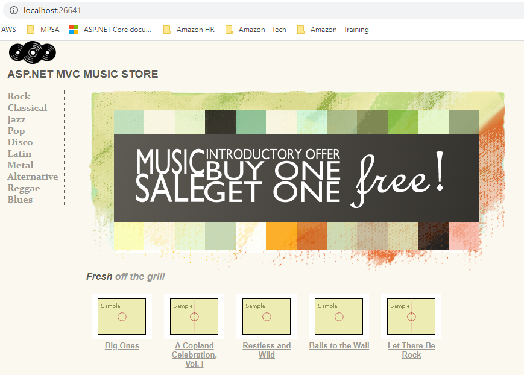

# MvcMusicStore
.NET Framework to .NET Core completed.

## License
This library is licensed under the Apache 2.0 License

## Pre-Requisites
1. Visual Studio 2019 16.4 or later with the ASP.NET and web development workload
2. Full .NET Framework 4.0 and 4.8
3. .NET Core 3.1 sdk or later.
4. SQL Server Management Studio
5. MS SQL Server (LocalDB version is perfectly suitable with appropriate connection string adjustments).
6. Git for Windows.

## Running locally
Once you have the prerequisites installed on your local development machine you should be able to run the Music Store locally in your IDE. The Music Store uses SQL Server for the backend by default and is seeded with data on startup. You will need to either provision or have access to a database. 

```PowerShell
docker-compose up --scale coreweb=2 --build
```

And browse to http://localhost:5000

